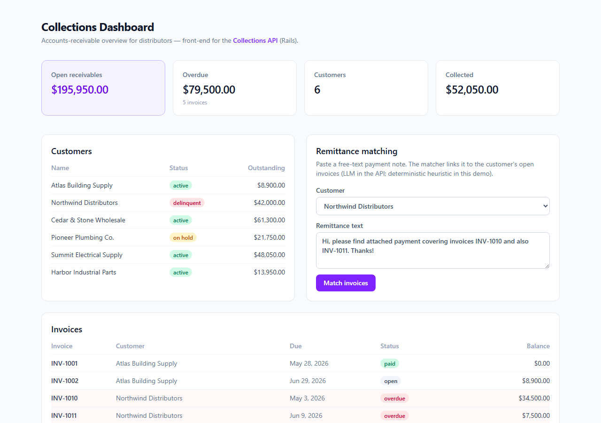

<!-- ══════════════════════════ PORTADA ══════════════════════════ -->
<div align="center">
  
</div>

<!-- ══════════════════════ IDIOMAS / LANGUAGES ══════════════════════ -->
<div align="center">
<a href="README.md"></a>
<a href="README.en.md"></a>
<a href="README.es.md"></a>
</div>

<h1 align="center">Collections Dashboard</h1>
<p align="center"><em>Dashboard de cuentas por cobrar para distribuidoras — el frontend de la Collections API</em></p>
<p align="center"><strong>Datos (demo o API real) → métricas → clientes/facturas → matching de remesas</strong></p>

<div align="center">


</div>

<div align="center">
<a href="#acerca-de"></a>
<a href="#funcionalidades"></a>
<a href="#tecnologías"></a>
<a href="#uso"></a>
</div>

<br/>

> 💡 **Funciona solo.** Viene con datos de demo integrados (route handlers de Next.js) — apunta `NEXT_PUBLIC_API_URL` a la API Rails real cuando quieras.

<div align="center">
  
</div>

## Acerca de

**Collections Dashboard** es un dashboard limpio de cuentas por cobrar (AR) para distribuidoras — el frontend complementario de la [Collections API](https://github.com/geoggrigori/collections-api) (Ruby on Rails). Funciona totalmente solo (datos de demo integrados + route handlers de Next.js), y puede apuntar a la API Rails real configurando `NEXT_PUBLIC_API_URL`.

## Funcionalidades

- **Métricas de AR** — cuentas por cobrar abiertas, exposición vencida, clientes, cobrado.
- **Tablas de clientes y facturas** con badges de estado y resaltado de atraso.
- **Demo de matching de remesas** — pega una nota de pago en texto libre y observa cómo se asocia a las facturas abiertas del cliente (en la API real esto lo hace un LLM; esta demo usa la misma heurística determinística que usa la API como fallback).
- **API integrada** — `/api/customers`, `/api/invoices`, `/api/metrics`, `/api/remittances/match` (route handlers), así que funciona en Vercel sin backend.

## Tecnologías

| Capa | Tecnología |
|---|---|
| Framework | Next.js 16 (App Router) |
| UI | React 19, Tailwind CSS |
| Lenguaje | TypeScript |
| Hosting | Vercel |

## Uso

```bash
npm install
npm run dev      # http://localhost:3000
```

Para conectar a la API real en vez de los datos de demo:
```bash
NEXT_PUBLIC_API_URL=https://tu-collections-api.example.com
```

**Estructura:**
```
src/
  app/
    page.tsx                 # dashboard (server component)
    api/                     # route handlers (customers, invoices, metrics, match)
  components/                # MetricCard, StatusBadge, RemittanceDemo
  lib/                       # types, datos de demo, helpers de formato
```

## Licencia

[MIT](LICENSE).

<div align="center">
  
</div>

<p align="center"><sub>Desarrollado por <strong><a href="https://github.com/geoggrigori">Grigori</a></strong> · 2026</sub></p>
